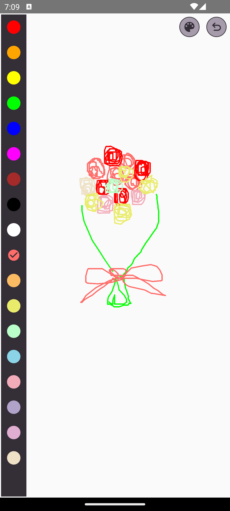

# Drawing App 

## Description:

Create beautiful artworks and express your creativity with our Android Drawing App! Our app offers a delightful drawing experience with a custom drawing view and a vibrant color palette designed to enhance your artistic journey.

## Key Features:

1. **Custom Drawing View**: Our app features a custom drawing view that allows users to draw freely on the screen using their fingertips. The drawing view provides smooth and responsive touch tracking, ensuring precise control over your strokes.

2. **Path Tracking**: We use advanced path tracking algorithms to accurately capture the user's touch movements as they draw. This allows for fluid and natural strokes, whether you're sketching, doodling, or creating intricate designs.

3. **Dynamic Color Palette**: Explore a custom color palette that offers a rich selection of colors to bring your imagination to life. Our color palette is intuitively designed, making it easy to switch between different colors as you work on your masterpiece.

4. **Radio Button Color Selection**: With our innovative color selection interface, users can effortlessly switch between colors using radio buttons. This simple yet effective method allows for quick color changes without interrupting your creative flow.

## Screenshots

